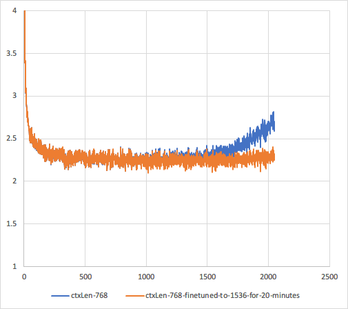
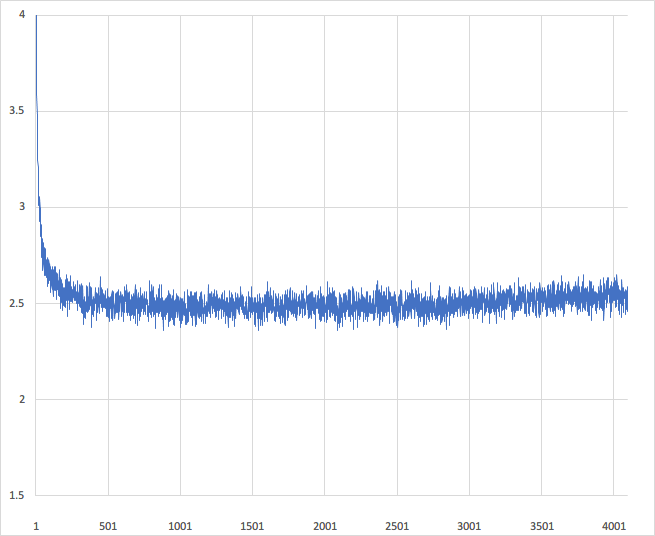

# RWKV-v2-RNN-Pile

RWKV-v2-RNN trained on the full Pile (no dev/val/test split). See https://github.com/BlinkDL/RWKV-LM for details.

Join our Discord! https://discord.gg/bDSBUMeFpc :)

Colab for fine-tuning: https://colab.research.google.com/drive/1BwceyZczs5hQr1wefmCREonEWhY-zeST

**NOTE: currently sample_logits() in run.py runs on cpu which is very slow (sometime it's slower than the model itself!). Move it to cuda for significant speedup.**

===================================================

RWKV-3 code: https://github.com/BlinkDL/RWKV-v2-RNN-Pile/tree/main/RWKV-v3

Preview 1.5B model: https://huggingface.co/BlinkDL/rwkv-3-pile-1b5

Preview 169M model: https://huggingface.co/BlinkDL/rwkv-3-pile-169m

===================================================

Training log: https://wandb.ai/blinkdl/RWKV-v2-RNN-Pile

You can use the "GPT" mode to quickly build the hidden state for the "RNN" mode. (I am not doing it in the run.py here so the initial generation is slower than usual).

I am training a 1.5B RWKV-3 (Search "RWKV-3" in https://github.com/BlinkDL/RWKV-LM for details):

## Fine-tuning

Use prepare_data.py to tokenize your .txt into .npy, then run finetune.py to fine-tune the Pile model.

Reduce batch_sz if you see CUDA OOM (and change B_GROUP_FORWARD and B_GROUP_BACKWARD in src/model_train.py to make sure they can divide batch_sz).

===================================================

You can set a longer ctxLen and it can adapt (try this: 768 -> 768 * 2, train for some hours, then 768 * 2 -> 768 * 3, ...).

The current models are trained with 768 ctxLen and the optimal ctxLen for RNN mode is around 1100. The positional loss goes up when ctxLen > 768 * 2. I am finetuning them to support longer ctxLen.

RWKV-2 trained with 768 ctxLen, and after 20 minutes of finetuning to 1536 ctxLen (1e-5 LR):

Therefore RWKV-2 can quickly adapt to "infinite" ctxLen via N->2N->3N->... (or if you use better training methods to begin with, such as 90% GPT + 10% RNN).

The only limiting factor is, right now I am clamping K to e^60, and this will create trouble for the model when the ctxLen is very long. It can be fixed with a better CUDA kernel.

===================================================

UPDATE: We have a new CUDA kernel in RWKV-4. Now the model can extrapolate to 3x ctxlen (trained using ctx1024 here):

And we can further improve it using transformer-XL style training.

## Pre-trained models

Model 20220615-10803 (see Releases, or https://huggingface.co/BlinkDL/rwkv-2-pile-430m/tree/main):

This is a L24-D1024 RWKV-v2-RNN trained on the Pile for 332B tokens.

**!!! Change 1e-9 to 1e-8 in model.py and model_train.py (RWKV_K_EPS) for this model !!!**

LAMBADA ppl 15.34 acc 42.42% (computed using https://github.com/EleutherAI/lm-evaluation-harness)

The Pile loss 2.349

===================================================

Model 20220524-4006 (see Releases):

This is a preview of a L24-D1024 RWKV-v2-RNN trained on the Pile for only 123B tokens.

LAMBADA ppl 15.88 acc 42.36% (computed using https://github.com/EleutherAI/lm-evaluation-harness)

The Pile loss 2.383

===================================================

Model 20220501-6548 (see Releases):

This is a preview of a L12-D768 RWKV-v2-RNN trained on the Pile for only 50B tokens.

Performance of the preview model:

LAMBADA ppl 52.45 acc 26.66% (computed using https://github.com/EleutherAI/lm-evaluation-harness)

The Pile loss 2.728
